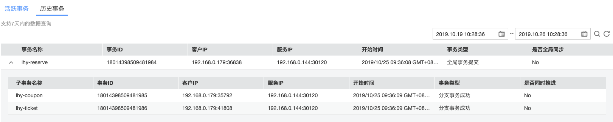

## 快速开始

### 前提条件

已经在[huaweicloud](https://www.huaweicloud.com)上开通账号，并且在[ServiceStage](https://www.huaweicloud.com/product/servicestage.html)上添加了微服务引擎和分布式事务引擎。

### step 1 引用jar依赖

因为spring-cloud-huawei还没有发布到公共仓库，如果要使用，需要先下载代码在本地构建。
    
    mvn clean install --settings .maven.settings.xml 

以下以maven为例。
项目中可以使用dependencyManagement引入依赖。

    <dependencyManagement>
      <dependencies>
        <dependency>
          <groupId>org.springframework.cloud.huawei</groupId>
          <artifactId>spring-cloud-huawei-dependencies</artifactId>
          <version>${project.version}</version>
          <type>pom</type>
          <scope>import</scope>
        </dependency>
      </dependencies>
    </dependencyManagement>

引入spring-cloud-starter-huawei-servicecomb-discovery，用于注册发现服务
    
    <dependency>
      <groupId>org.springframework.cloud</groupId>
      <artifactId>spring-cloud-starter-huawei-servicecomb-discovery</artifactId>
    </dependency>

引入spring-cloud-starter-huawei-dtm，用于分布式事务

    <dependency>
      <groupId>org.springframework.cloud</groupId>
      <artifactId>spring-cloud-starter-huawei-dtm</artifactId>
    </dependency>
    

  
  
### step 2 新建Project或module，定义全局事务，支持通过RestTemplate和Feign两种模式调用分支事务。
通过配置文件(application.yml)定义事务信息

    dtm:
      appName: reserve #应用名称
      rpc:
        sslEnabled: true  #是否启用ssl
      proxy:
        endpoint: https://192.168.0.5:30125 #dtm服务地址，从dtm引擎中获取

通过注解DTMTxBegin定义全局事务

    @DTMTxBegin(appName = "reserve")
    
### step 3 新建Project或module，定义分支事务
同样，通过配置文件(application.yml)定义事务信息

    dtm:
      appName: coupon #应用名称
      rpc:
        sslEnabled: true  #是否启用ssl
      proxy:
        endpoint: https://192.168.0.5:30125 #dtm服务地址，从dtm引擎中获取

通过注解DTMTccBranch定义分支事务，放到"try"方法上。通过confirmMethod和cancelMethod定义确认和回滚方法

      @GetMapping(value = "/discountCoupon")
      @DTMTccBranch(identifier = "coupon", confirmMethod = "confirm", cancelMethod = "cancel")
      public void discountCoupon() throws InterruptedException {
        //try,预留资源，判断是否可以执行。如库存服务，可以在数据库中增加字段，预减库存
      }
    
      public void confirm() {
        //confirm，可以理解为事务提交，如库存服务，真正的把预留的库存扣掉
      }
    
      public void cancel() {
        //cancel,回滚方法，当出现异常的时候调用此方法释放资源，如库存服务，释放预留库存
      }
### step 4 在huaweicloud分布式事务控制面板上查看事务执行情况。

  